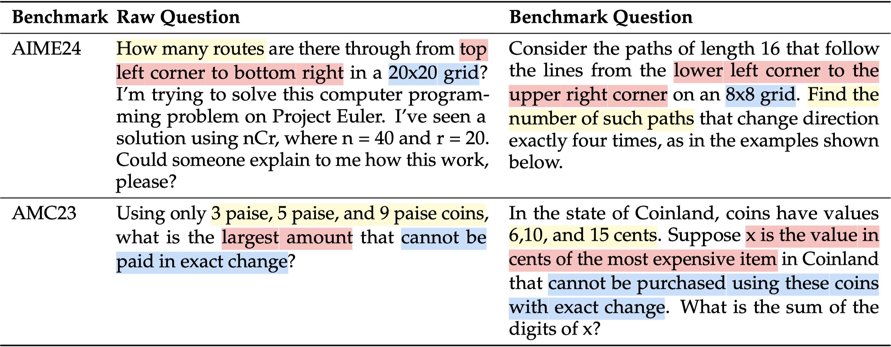

# DeepMath

🗄️ A Large-Scale, Challenging, Verifiable, and Decontaminated Mathematical Dataset for Advancing Reasoning

 

## 🔥 News

- **April 14, 2025**: We release **`DeepMath-103K`**, a large-scale dataset featuring challenging, verifiable, and decontaminated math problems tailored for SFT and RL. We open source:
  - 🤗 Training data: [`DeepMath-103K`](https://huggingface.co/datasets/zwhe99/DeepMath-103K)
  - 💻 Code: [`DeepMath`](https://github.com/zwhe99/DeepMath)
  - 📝 Paper detailing data curation: [`arXiv:xxxx.xxxxx`](https://www.google.com/search?q=[https://arxiv.org/abs/xxxx.xxxxx](https://arxiv.org/abs/xxxx.xxxxx))
  - *(Coming Soon)*: Model weights trained on DeepMath.

## 📖 Overview

`DeepMath-103K` is meticulously curated to push the boundaries of mathematical reasoning in language models. Key features include:

**1. Challenging Problems**: DeepMath-103K has a strong focus on difficult mathematical problems (primarily Levels 5-9), significantly raising the complexity bar compared to many existing open datasets.

 

Difficulty distribution comparison (details in paper). 

**2. Broad Topical Diversity**: The dataset spans a wide spectrum of mathematical subjects, including Algebra, Calculus, Number Theory, Geometry, Probability, and Discrete Mathematics.

 

Hierarchical breakdown of mathematical topics covered in DeepMath-103K.

**4. Rigorous Decontamination**: Built from diverse sources, the dataset underwent meticulous decontamination against common benchmarks using semantic matching. This minimizes test set leakage and promotes fair model evaluation.

 

An example data sample from DeepMath-103K. 

**5. Rich Data Format**: Each sample in `DeepMath-103K` is structured with rich information to support various research applications:

 
An example data sample from DeepMath-103K. 

- **Question**: The mathematical problem statement.
- **Final Answer**: A reliably verifiable final answer, enabling robust rule-based reward functions for RL.
- **Difficulty**: A numerical score for difficulty-aware training or analysis.
- **Topic**: Hierarchical classification for topic-specific applications.
- **R1 Solutions**: Three distinct reasoning paths from DeepSeek-R1, valuable for supervised fine-tuning (SFT) or knowledge distillation.
