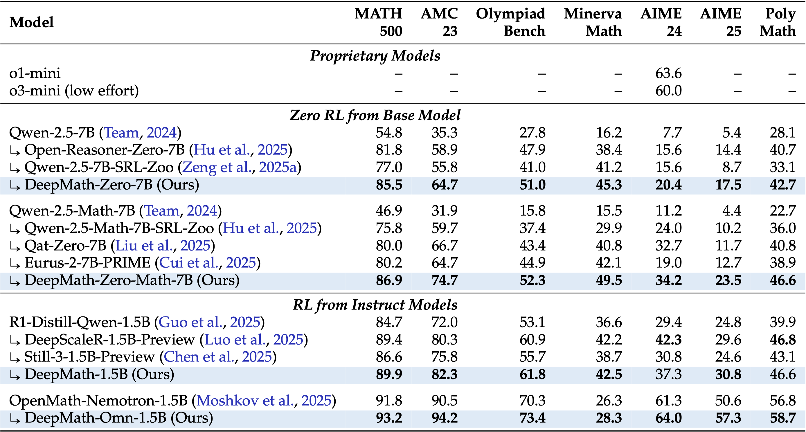

<div align="center">

# _🧠 DeepMath_

<div>
 A Large-Scale, Challenging, Decontaminated, and Verifiable Mathematical Dataset for Advancing Reasoning
</div>
</div>

<div>
<br>

<div align="center">

[](https://huggingface.co/datasets/zwhe99/DeepMath-103K)
[](https://huggingface.co/collections/zwhe99/deepmath-6816e139b7f467f21a459a9a)
[](https://github.com/zwhe99/DeepMath)
[](https://github.com/zwhe99/DeepMath)
[](https://arxiv.org/abs/2504.11456)
</div>
</div>

## 🔥 News
- **May 8, 2025**: We found that 48 samples contained hints that revealed the answers. The relevant questions have now been revised to remove the leaked answers.
- **April 14, 2025**: We release **`DeepMath-103K`**, a large-scale dataset featuring challenging, verifiable, and decontaminated math problems tailored for RL and SFT. We open source:

## 📦 Resource

- 🤗 Training data: [`DeepMath-103K`](https://huggingface.co/datasets/zwhe99/DeepMath-103K)
- 🤗 Model weights: [`DeepMath-Zero-7B`](https://huggingface.co/zwhe99/DeepMath-Zero-7B), [`DeepMath-Zero-Math-7B`](https://huggingface.co/zwhe99/DeepMath-Zero-Math-7B), [`DeepMath-1.5B`](https://huggingface.co/zwhe99/DeepMath-1.5B),  [`DeepMath-Omn-1.5B`](https://huggingface.co/zwhe99/DeepMath-Omn-1.5B)
- 💻 Code: [`DeepMath`](https://github.com/zwhe99/DeepMath)
- 📝 Paper: [`arXiv:2504.11456`](https://arxiv.org/abs/2504.11456)


## 📖 Overview

**`DeepMath-103K`** is meticulously curated to push the boundaries of mathematical reasoning in language models. Key features include:

**1. Challenging Problems**: DeepMath-103K has a strong focus on difficult mathematical problems (primarily Levels 5-9), significantly raising the complexity bar compared to many existing open datasets.

<div align="center"> 

<sub>Difficulty distribution comparison.</sub> </div>

**2. Data Diversity and Novelty**: DeepMath-103K spans a wide spectrum of mathematical subjects, including Algebra, Calculus, Number Theory, Geometry, Probability, and Discrete Mathematics.

<div align="center"> 

<sub>Hierarchical breakdown of mathematical topics covered in DeepMath-103K.</sub></div>

The problems in DeepMath-103K are novel and unique, whereas many existing datasets are similar and overlap.
<div align="center"> 

<sub>Embedding distributions of different datasets.</sub></div>

**3. Rigorous Decontamination**: Built from diverse sources, DeepMath-103K underwent meticulous decontamination against common benchmarks using semantic matching. This minimizes test set leakage and promotes fair model evaluation.

<div align="center"> 

<sub>Detected contamination examples. Subtle conceptual overlaps can also be identified.</sub> </div>

**4. Rich Data Format**: Each sample in DeepMath-103K is structured with rich information to support various research applications:

<div align="center"> 

<sub>An example data sample from DeepMath-103K.</sub> </div>

- **Question**: The mathematical problem statement.
- **Final Answer**: A reliably verifiable final answer, enabling robust rule-based reward functions for RL.
- **Difficulty**: A numerical score for difficulty-aware training or analysis.
- **Topic**: Hierarchical classification for topic-specific applications.
- **R1 Solutions**: Three distinct reasoning paths from DeepSeek-R1, valuable for supervised fine-tuning (SFT) or knowledge distillation.

## 📊Main Results

DeepMath serise models achieve many **SOTA** results on challenging math benchmarks:

<div align="center"> 

<sub>Math reasoning performance.</sub> </div>


## 🎯Quick Start

#### Environment Preparation

```shell
git clone --recurse-submodules https://github.com/zwhe99/DeepMath.git && cd DeepMath

conda create -y -n deepmath python=3.12.2 && conda activate deepmath
pip3 install ray[default]
pip3 install torch==2.5.1 torchvision==0.20.1 torchaudio==2.5.1 --index-url https://download.pytorch.org/whl/cu124
pip3 install flash-attn==2.7.4.post1 --no-build-isolation
pip3 install omegaconf==2.4.0.dev3 hydra-core==1.4.0.dev1 antlr4-python3-runtime==4.11.0 vllm==0.7.3
pip3 install math-verify[antlr4_11_0]==0.7.0 fire deepspeed tensorboardX prettytable datasets transformers==4.49.0
pip3 install -e verl
pip3 install langdetect==1.0.9 pebble==5.1.0 word2number
```


#### Evaluation

We use different system prompt for different models. Adjust `--system_prompt_name` according to the following table:

| Model                 | System Prompt Name |
| --------------------- | ------------------ |
| DeepMath-Zero-7B      | simplerl           |
| DeepMath-Zero-Math-7B | simplerl           |
| DeepMath-1.5B         | disabled           |
| DeepMath-Omn-1.5B     | disabled           |


Example eval script for DeepMath-Zero-7B:

```shell
VLLM_ALLOW_LONG_MAX_MODEL_LEN=1 VLLM_ATTENTION_BACKEND=XFORMERS VLLM_USE_V1=1 VLLM_WORKER_MULTIPROC_METHOD=spawn python3 uni_eval.py \
    --base_model zwhe99/DeepMath-Zero-7B \
    --chat_template_name default \
    --system_prompt_name simplerl \
    --output_dir  \
    --bf16 True \
    --tensor_parallel_size 8 \
    --data_id zwhe99/MATH \
    --split math500 \
    --max_model_len 32768 \
    --temperature 0.6 \
    --top_p 0.95 \
    --n 16
```


#### Training

* Data Preparation

  ```shell
  DATA_DIR=/path/to/your/data
  python3 verl/examples/data_preprocess/deepmath_103k.py --local_dir $DATA_DIR
  ```

* Start Ray

  ```shell
  # Head node (×1)
  ray start  --head --port=6379  --node-ip-address=$HEAD_ADDR --num-gpus=8
  
  # Worker nodes (×7 or ×11)
  ray start  --address=$HEAD_ADDR:6379 --node-ip-address=$WORKER_ADDR --num-gpus=8
  ```

* Launch training at head node. See `scripts/train` for training scripts.


## 🙏 Acknowledgements

This work can not be done without the help of the following works:

- **[verl](https://github.com/volcengine/verl)**: A very fast reinforcement learning framework.
- **[Vivacem/MMIQC](https://huggingface.co/datasets/Vivacem/MMIQC)**: A mixture of question-response pairs extracted from Mathematics Stack Exchange pages.
- **[TIGER-Lab/WebInstructSub](https://huggingface.co/datasets/TIGER-Lab/WebInstructSub)**: Instruction data from MathStackExchange and ScienceStackExchange.
- **[AI-MO/NuminaMath-CoT](https://huggingface.co/datasets/AI-MO/NuminaMath-CoT)**: Approximately 860k math problems.


## 📚 Citation
```bibtex
@article{deepmath,
  title={DeepMath-103K: A Large-Scale, Challenging, Decontaminated, and  Verifiable Mathematical Dataset for Advancing Reasoning},
  author={He, Zhiwei and Liang, Tian and Xu, Jiahao and Liu, Qiuzhi and Chen, Xingyu and Wang, Yue and Song, Linfeng and Yu, Dian and Liang, Zhenwen and Wang, Wenxuan and Zhang, Zhuosheng and Wang, Rui and Tu, Zhaopeng and Mi, Haitao and Yu, Dong},
  year={2025},
  eprint={2504.11456},
  archivePrefix={arXiv},
  primaryClass={cs.CL},
  url={https://arxiv.org/abs/2504.11456}, 
}
```
