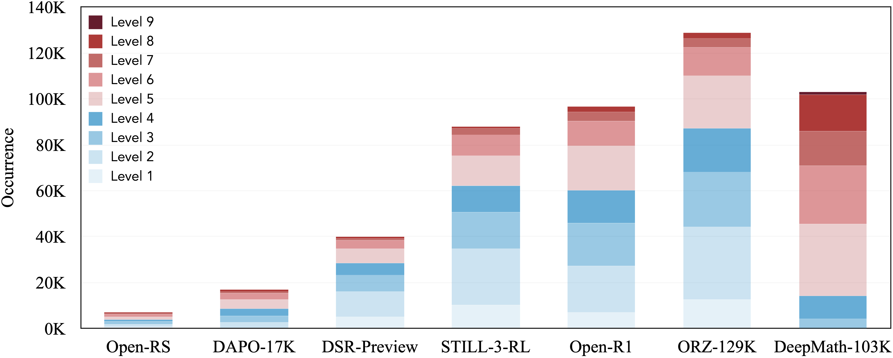

# DeepMath

🗄️ A Large-Scale, Challenging, Verifiable, and Decontaminated Mathematical Dataset for Advancing Reasoning

 

## 🔥 News

- **April 14, 2025**: We release the **`DeepMath-103K`**, a large-scale training dataset tailered for RL and SFT with challenging, verifiable and decontaminated math problems. We open source:
  - 🤗 Model weights: comming soon
  - 🤗 Training data: [`DeepMath-103K`](https://huggingface.co/datasets/zwhe99/DeepMath-103K)
  - 💻 Code: [`DeepMath`](https://github.com/zwhe99/DeepMath)
  - 📝 Data curation process: [`arXiv`](https://arxiv.org/abs/xxxx.xxxxx)

## 📖 Overview

**Challenging**: DeepMath-103K features a high concentration of difficult mathematical problems (Levels 5-9), significantly exceeding the complexity found in typical open datasets.

Difficulty distribution of open datasets.

**Broad Topical Diversity**: DeepMath-103K spans a wide spectrum of mathematical subjects, including Algebra, Calculus, Number Theory, Geometry, Probability, and Discrete Mathematics, ensuring comprehensive topical exposure for models.

Hierarchical breakdown of covered mathematical topics in DeepMath-103K.

**Data Sample**: Each data sample in \method{} is intentionally structured to be comprehensive, supporting a variety of downstream applications in mathematical reasoning research:

* Question: The mathematical problem statement.
* Final Answer: A verifiable final answer, crucial for enabling rule-based reward functions in RL settings.
* Difficulty: A numerical difficulty score, which facilitates techniques like difficulty-aware training (e.g., curriculum learning) or adaptive compute allocation based on problem complexity.
* Topic: A hierarchical topic classification for the problem, enabling topic-specific analysis or training.
* R1 Solutions: Three distinct reasoning paths generated by the DeepSeek-R1 model.

An example data sample from the DeepMath=103K

